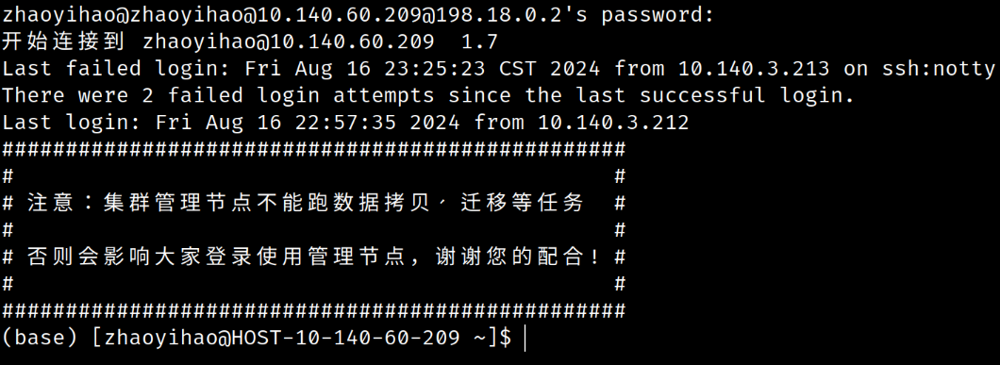
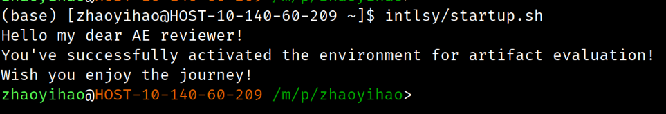
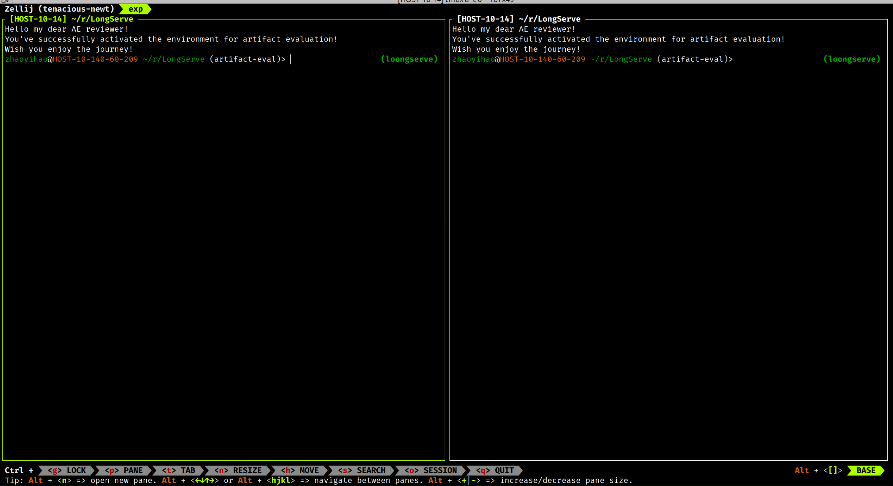

# LoongServe Artifact Evaluation Guide

This is the artifact of the paper "LoongServe: Efficiently Serving Long-context Large Language Models with Elastic Sequence Parallelism". We are going to guide you through the process of reproducing the main results in the paper.

Here is a high-level overview of the whole process:
1. Log in to the cluster via the jump server and SSH.
2. Activate the environment.
3. Kick-the-tires. Run some toy examples to get familiar with the cluster and the environment.
4. Reproduce the main results. Run the experiments and generate the figures.

## Contents

- [LoongServe Artifact Evaluation Guide](#loongserve-artifact-evaluation-guide)
  - [Contents](#contents)
  - [Log into the Cluster](#log-into-the-cluster)
    - [Connect to the Cluster](#connect-to-the-cluster)
    - [Activate the Environment](#activate-the-environment)
  - [Environment Setup](#environment-setup)
  - [Dataset Preprocessing](#dataset-preprocessing)
  - [Kick-the-Tires](#kick-the-tires)
    - [Allocate a Compute Node](#allocate-a-compute-node)
    - [Run a Toy Example](#run-a-toy-example)
  - [Reproduce the Main Results](#reproduce-the-main-results)
    - [Reproduce Figure 2](#reproduce-figure-2)
    - [Reproduce Figure 3](#reproduce-figure-3)
    - [Reproduce Figure 13](#reproduce-figure-13)
    - [Reproduce the Analytical Model and Figure 14](#reproduce-the-analytical-model-and-figure-14)
    - [Reproduce Figure 10](#reproduce-figure-10)
      - [LoongServe + ShareGPT](#loongserve--sharegpt)
      - [LoongServe + LEval](#loongserve--leval)
      - [LoongServe + LV-Eval](#loongserve--lv-eval)
      - [LoongServe + Mixed](#loongserve--mixed)
      - [vLLM + ShareGPT](#vllm--sharegpt)
      - [vLLM + LEval](#vllm--leval)
      - [vLLM + LV-Eval](#vllm--lv-eval)
      - [vLLM + Mixed](#vllm--mixed)
      - [LightLLM (w/ SplitFuse) + ShareGPT](#lightllm-w-splitfuse--sharegpt)
      - [LightLLM (w/ SplitFuse) + LEval](#lightllm-w-splitfuse--leval)
      - [LightLLM (w/ SplitFuse) + LV-Eval](#lightllm-w-splitfuse--lv-eval)
      - [LightLLM (w/ SplitFuse) + Mixed](#lightllm-w-splitfuse--mixed)
      - [DeepSpeed-MII (Dynamic SplitFuse) + ShareGPT](#deepspeed-mii-dynamic-splitfuse--sharegpt)
      - [DistServe (Prefill-Decoding Disaggregation) + ShareGPT](#distserve-prefill-decoding-disaggregation--sharegpt)
      - [DistServe (Prefill-Decoding Disaggregation) + LEval](#distserve-prefill-decoding-disaggregation--leval)
    - [Reproduce Figure 11](#reproduce-figure-11)
      - [Setting up the Ray Cluster](#setting-up-the-ray-cluster)
      - [Generate the Analytical Model for Multiple Nodes](#generate-the-analytical-model-for-multiple-nodes)
      - [Run LoongServe on Multiple Nodes](#run-loongserve-on-multiple-nodes)
      - [Run vLLM on Multiple Nodes](#run-vllm-on-multiple-nodes)
      - [Run LightLLM-sf on Multiple Nodes](#run-lightllm-sf-on-multiple-nodes)
      - [Plotting](#plotting)
    - [Reproduce Figure 12](#reproduce-figure-12)
      - [LoongServe](#loongserve)
      - [LoongServe w/o ESP (TP=2, SP=4)](#loongserve-wo-esp-tp2-sp4)
      - [LoongServe w/o ESP (TP=8)](#loongserve-wo-esp-tp8)
      - [LoongServe w/o ESP (TP=2) x 4](#loongserve-wo-esp-tp2-x-4)

## Log into the Cluster

*5 human minutes + 5 machine minutes*

### Connect to the Cluster

Please refer to the *Technical Requirements* section on the HotCRP AE page for the connection information.

### Activate the Environment

Every time after log into the cluster, you may see a prompt like this:



Please **immediately** execute the following command to activate our environment:

```bash
intlsy/startup.sh
```

And you will see the prompt change to:



To avoid interference with other AE reviewers, please choose a unique AE reviewer name (e.g. `ae1`, `ReviewerA`, `Kiana-Kaslana`) (please avoid using spaces and other special characters). We will call this "AE ID" in the following instructions. After setting AE ID, please execute:

```bash
export EXP_RESULT_ROOT_PATH=/mnt/petrelfs/zhaoyihao/intlsy/research/exp-results/<YOUR-AE-ID>
```

You need to execute this command manually every time after logg into the cluster. Do not store this command in your `.bashrc` or `config.fish` since it may interfere with other AE reviewers.

## Environment Setup

To save you time, we have already prepared the necessary conda environments for you. If you want to reproduce the environment, please follow [this instruction](supplemental/repro-environment.md).

## Dataset Preprocessing

LoongServe's benchmarking script samples requests from preprocessed dataset files. To save you time, we've preprocessed the datasets in advance and saved them to `/mnt/petrelfs/zhaoyihao/intlsy/research/datasets/preprocessed`. You may refer to [this instruction](supplemental/repro-dataset.md) if you want to preprocess the datasets by yourself.

## Kick-the-Tires

*10 human minutes + 10 machine minutes*

### Allocate a Compute Node

*5 human minutes + 5 machine minutes*

First, use our script (a wrapper of `salloc`) to allocate a compute node:

```bash
python3 ~/salloc.py
```

It should print something like:

```
zhaoyihao@HOST-XX-XXX-XX-XXX ~> ~/salloc.py
Allocating an instance with 128 cpus and 8 gpus, type: auto
command: salloc -p llm_s -n1 --cpus-per-task=128 -N1 --gres=gpu:8 --quotatype=auto /mnt/petrelfs/zhaoyihao/intlsy/startup.sh salloc
salloc: Pending job allocation 1234567
salloc: job 1234567 queued and waiting for resources
salloc: job 1234567 has been allocated resources
salloc: Job 1234567 scheduled successfully!
Current QUOTA_TYPE is [reserved], which means the job has occupied quota in RESERVED_TOTAL under your partition.
Current PHX_PRIORITY is normal

salloc: Granted job allocation 1234567
Hello my dear AE reviewer!
You've successfully activated the environment for artifact evaluation!
Wish you enjoy the journey!
zhaoyihao@HOST-XX-XXX-XX-XXX ~>
```

This means you've successfully allocated a compute node. It should be equipped with 128 CPUs and 8 GPUs. Then you can use `srun` to launch a job on this node, for example:

```bash
srun nvidia-smi
```

It should result in:

```
zhaoyihao@HOST-XX-XXX-XX-XXX ~> srun nvidia-smi                                                                                                                                     (base) 

XXX XXX XX XX:XX:XX XXXX       
+---------------------------------------------------------------------------------------+
| NVIDIA-SMI XXX.XXX.XX             Driver Version: XXX.XXX.XX   CUDA Version: XX.X     |
|-----------------------------------------+----------------------+----------------------+
| GPU  Name                 Persistence-M | Bus-Id        Disp.A | Volatile Uncorr. ECC |
| Fan  Temp   Perf          Pwr:Usage/Cap |         Memory-Usage | GPU-Util  Compute M. |
|                                         |                      |               MIG M. |
|=========================================+======================+======================|
|   0  NVIDIA A800-SXM4-80GB          On  | 00000000:21:00.0 Off |                    0 |
| N/A   26C    P0              57W / 400W |      2MiB / 81920MiB |      0%      Default |
|                                         |                      |             Disabled |
+-----------------------------------------+----------------------+----------------------+
|   1  NVIDIA A800-SXM4-80GB          On  | 00000000:27:00.0 Off |                    0 |
| N/A   28C    P0              55W / 400W |      2MiB / 81920MiB |      0%      Default |
|                                         |                      |             Disabled |
+-----------------------------------------+----------------------+----------------------+
... (omitted)
```

### Run a Toy Example

*5 human minutes + 5 machine minutes*

We have prepared an example, which simply runs LoongServe against a simple input on the [LWM-Text-1M](https://huggingface.co/LargeWorldModel/LWM-Text-1M/tree/main) model.

```bash
srun python /mnt/petrelfs/zhaoyihao/intlsy/research/LongServe/test/longserve/1-benchmark-identical-req.py longserve-ae-toy-example
```

It should print something like:

```
Selected test group: longserve-ae-toy-example
Total number of params to run: 1
==================================
==================================
Creating SUT with worker param WorkerParam(model_dir='/mnt/petrelfs/zhaoyihao/intlsy/weights/LWM-Text-1M', sp_world_size=4, tp_world_size=2, max_total_token_num=210000, max_req_num=1024, max_seq_len=210000, mode=['_token_decode_attention_overlapped'])
You are using the default legacy behaviour of the <class 'transformers.models.llama.tokenization_llama.LlamaTokenizer'>. This is expected, and simply means that the `legacy` (previous) behavior will be used so nothing changes for you. If you want to use the new behaviour, set `legacy=False`. This should only be set if you understand what it means, and thoroughly read the reason why this was added as explained in https://github.com/huggingface/transformers/pull/24565 - if you loaded a llama tokenizer from a GGUF file you can ignore this message
Creating workers...
Scheduling all workers on one node...
XXXX-XX-XX XX:XX:XX,XXX	INFO worker.py:1772 -- Started a local Ray instance. View the dashboard at http://127.0.0.1:8265 
Initializing models...
(LongServeWorker pid=40391) (0, 0) Worker initializing with sp_rank = 0/4, tp_rank = 0/2, total_rank = 0/8
... (omitted)
Running
Pred output[0]: 37 38 39 40 41 
Prefill time usage: avg 32.83567810058594, stddev 0.0
Decoding time usage: avg 12.398143768310547, stddev 0.3179414233076983
```

Congratulations! This means you've successfully run the toy example. You can now proceed to reproduce the main results in the paper.

## Reproduce the Main Results

In general, we have two types of experiments:

- Profiling. We feed the system with a batch of requests, and measure the time usage. This includes figure 2, 3, and 13. Later we use those data to fit the analytical model, and generate figure 14.
- Serving. We use a load generator to send requests to the serving system. This includes figure 10, 11, and 12.

Before running the experiments, you need to activate the environment and then use `salloc` to obtain a compute node. See the previous section for details.

### Reproduce Figure 2

*5 human minutes + 20 machine minutes*

To reproduce figure 2, run the following command:

```bash
srun python3 ~/research/LongServe/test/longserve/1-benchmark-identical-req.py longserve-ae-figure2
```

This script feeds LoongServe with batches of requests and measures the time usage. It should generate a `.sqlite3` file at `~/research/exp-results/<YOUR-AE-ID>/loongserve-db-identical-req.sqlite`.

Since there seems to be something wrong with Shanghai AI Lab's cluster, sometimes Ray stucks at creating new actors, which results in the following error:

```bash
Creating SUT with worker param WorkerParam(model_dir='/mnt/petrelfs/zhaoyihao/intlsy/weights/LWM-Text-1M', sp_world_size=2, tp_world_size=4, max_total_token_num=404000, max_req_num=1024, 
max_seq_len=510000, mode=['_token_decode_attention_overlapped'])
Creating workers...
Scheduling all workers on one node...
Traceback (most recent call last):
  File "/mnt/petrelfs/zhaoyihao/intlsy/research/LongServe/test/longserve/1-benchmark-identical-req.py", line 457, in <module>
    test_group_candidates[select_test_group]()
  File "/mnt/petrelfs/zhaoyihao/intlsy/research/LongServe/test/longserve/1-benchmark-identical-req.py", line 445, in <lambda>
    "longserve-ae-analytical-model-single-node": lambda: run_longserve(get_time_with_batch_size_params(False)),
                                                         ^^^^^^^^^^^^^^^^^^^^^^^^^^^^^^^^^^^^^^^^^^^^^^^^^^^^^
  File "/mnt/petrelfs/zhaoyihao/intlsy/research/LongServe/test/longserve/1-benchmark-identical-req.py", line 414, in run_longserve
    run_test_params(LongServeSUT, LOONGSERVE_DB_IDENTICAL_REQ_PATH, test_params, **kwargs)
  File "/mnt/hwfile/zhaoyihao/intlsy/research/LongServe/test/longserve/lib/run_test_param_group.py", line 39, in run_test_params
    sut = sut_class(worker_param)
          ^^^^^^^^^^^^^^^^^^^^^^^
  File "/mnt/hwfile/zhaoyihao/intlsy/research/LongServe/test/longserve/lib/sut_longserve.py", line 54, in __init__
    ray.get(placement_group.ready(), timeout=20)
  File "/mnt/hwfile/zhaoyihao/intlsy/miniforge3/envs/loongserve/lib/python3.12/site-packages/ray/_private/auto_init_hook.py", line 21, in auto_init_wrapper
    return fn(*args, **kwargs)
           ^^^^^^^^^^^^^^^^^^^
  File "/mnt/hwfile/zhaoyihao/intlsy/miniforge3/envs/loongserve/lib/python3.12/site-packages/ray/_private/client_mode_hook.py", line 103, in wrapper
    return func(*args, **kwargs)
           ^^^^^^^^^^^^^^^^^^^^^
  File "/mnt/hwfile/zhaoyihao/intlsy/miniforge3/envs/loongserve/lib/python3.12/site-packages/ray/_private/worker.py", line 2659, in get
    values, debugger_breakpoint = worker.get_objects(object_refs, timeout=timeout)
                                  ^^^^^^^^^^^^^^^^^^^^^^^^^^^^^^^^^^^^^^^^^^^^^^^^
  File "/mnt/hwfile/zhaoyihao/intlsy/miniforge3/envs/loongserve/lib/python3.12/site-packages/ray/_private/worker.py", line 848, in get_objects
    data_metadata_pairs = self.core_worker.get_objects(
                          ^^^^^^^^^^^^^^^^^^^^^^^^^^^^^
  File "python/ray/_raylet.pyx", line 3511, in ray._raylet.CoreWorker.get_objects
  File "python/ray/includes/common.pxi", line 81, in ray._raylet.check_status
ray.exceptions.GetTimeoutError: Get timed out: some object(s) not ready.
srun: error: HOST-XX-XXX-XX-XX: task 0: Exited with exit code 1
```

If this happens, just restart the script. The script will automatically skip the existing data and continue the experiment.

Then use the following script to generate the figure:

```bash
python3 ~/research/LongServe/test/longserve/ae-plot-fig-2-3-13-14.py --fig 2 --ae-id <YOUR-AE-ID>
```

The figure will be stored at `~/research/exp-results/<YOUR-AE-ID>/fig2.png`. You may use VSCode to view it.

### Reproduce Figure 3

*5 human minutes + 20 machine minutes*

To reproduce figure 3, run the following command:

```bash
srun python3 ~/research/LongServe/test/longserve/1-benchmark-identical-req.py longserve-ae-figure3
```

Then use the following script to generate the figure:

```bash
python3 ~/research/LongServe/test/longserve/ae-plot-fig-2-3-13-14.py --fig 3 --ae-id <YOUR-AE-ID>
```

The figure will be stored at `~/research/exp-results/<YOUR-AE-ID>/fig3.png`.

### Reproduce Figure 13

*5 human minutes + 30 machine minutes*

To reproduce figure 13, run the following command:

```bash
srun python3 ~/research/LongServe/test/longserve/1-benchmark-identical-req.py longserve-ae-figure13
```

Then use the following script to generate the figure:

```bash
python3 ~/research/LongServe/test/longserve/ae-plot-fig-2-3-13-14.py --fig 13 --ae-id <YOUR-AE-ID>
```

The figure will be stored at `~/research/exp-results/<YOUR-AE-ID>/fig13.png`.

### Reproduce the Analytical Model and Figure 14

*10 human minutes + 7 machine hours (only if you want to reproduce the analytical model yourself)*

Now we are going to reproduce the analytical model and figure 14 (i.e. accuracy of LoongServe analytical model).

Since this takes a long time (7 hours), we have already prepared the results for you. You can copy-paste the final `.sqlite3` file via the following command:

```bash
cp ~/research/exp-results/intlsy/loongserve-db-identical-req-single-node.sqlite ~/research/exp-results/<YOUR-AE-ID>/loongserve-db-identical-req.sqlite
```

If you really want to produce the final `.sqlite3` file yourself, you may use the following command. As a warning, this script runs LoongServe against about 2000 different batches and may take up to 7 hours.

```bash
srun python3 ~/research/LongServe/test/longserve/1-benchmark-identical-req.py longserve-ae-analytical-model-single-node
```

After obtaining the `loongserve-db-identical-req.sqlite` via commands above, use the following script to fit the analytical model:

```bash
python3 ~/research/LongServe/test/longserve/2-find-time-function-prefill.py --profile-db ~/research/exp-results/<YOUR-AE-ID>/loongserve-db-identical-req.sqlite --output-csv ~/research/exp-results/<YOUR-AE-ID>/analytical-model.csv
```

It should print a lot of things, but the most important part is the arithmetic and geometric mean of the relative error. It should be less than 10%.

And finally, use the following script to generate figure 14:

```bash
python3 ~/research/LongServe/test/longserve/ae-plot-fig-2-3-13-14.py --fig 14 --ae-id <YOUR-AE-ID>
```

The figure will be stored at `~/research/exp-results/<YOUR-AE-ID>/fig14.png`.

### Reproduce Figure 10

*1 human hours + 24 machine hours (but you can select to perform only a subset of experiments)*

Now we have successfully obtained the analytical model. Time for some online inference experiments!

Figure 10, 11, and 12 are online inference experiments. We will first launch LoongServe (and the other baselines) as an API server, and then start a client to synthesize workloads and feed them to the server.

To avoid network interference, we will launch both the server and client on the compute node. To achieve this, we first use `~/salloc.py` to allocate a compute node, and then launch Zellij (a terminal multiplexer, like tmux or screen):

```bash
zellij
```

You should see a terminal split into two panes, like this:



You can use your mouse to switch between the two panes (just click on them!). In the left pane, we will launch the server (so we refer to the left pane as "S-terminal"), while we will launch the client in the right pane ("C-terminal").

We have 4 datasets and 5 frameworks, which leads to 15 sub-experiments in total (not 20 since some baselines cannot run on certain datasets). It takes a long time (24 machine hours) to run all of them. You may just pick your favourite framework and dataset, and run the combination of them. You can use the following script to plot fig 10 after finishing any sub-experiments.

```bash
python3 ~/research/LongServe/test/longserve/ae-plot-fig-10-11-12.py --fig 10 --ae-id <YOUR-AE-ID>
```

The figure will be stored at `~/research/exp-results/<YOUR-AE-ID>/fig10.png`.

**NOTE. Before running the following experiments, make sure you have generated the analytical model. You can follow the instructions in section "Reproduce the Analytical Model and Figure 14"**.

#### LoongServe + ShareGPT

To run LoongServe on the ShareGPT dataset, execute the following command in the S terminal:

```bash
srun python3 ~/research/LongServe/test/longserve/5-start-api-server.py --backend longserve -tp 2 -sp 4 --dataset sharegpt
```

Wait for the server to start. After it starts you should see a message like

```
# (RouterManager pid=XXXXX) DEBUG XX-XX XX:XX:XX [stats.py:95] Avg prompt batch size:      0.0
```

And then enter this in the C terminal:

```bash
srun python3 ~/research/LongServe/test/longserve/5-benchmark-serving.py --backend longserve --dataset ~/research/datasets/preprocessed/sharegpt.ds --num-prompts-req-rates "[(1000, 1), (19000, 19), (20000, 22), (20000, 24), (20000, 26), (20000, 28)]"
```

#### LoongServe + LEval

To run LoongServe on the LEval dataset, execute the following command in the S terminal:

```bash
srun python3 ~/research/LongServe/test/longserve/5-start-api-server.py --backend longserve -tp 2 -sp 4 --dataset leval
```

Wait for the server to start. After it starts you should see a message like

```
# (RouterManager pid=64568) DEBUG XX-XX XX:XX:XX [stats.py:95] Avg prompt batch size:      0.0
```

And then enter this in the C terminal:

```bash
srun python3 ~/research/LongServe/test/longserve/5-benchmark-serving.py --backend longserve --dataset ~/research/datasets/preprocessed/leval.ds --num-prompts-req-rates "[(100, 0.3), (500, 1.0), (2000, 2), (2000, 2.2), (3000, 2.4)]"
```

#### LoongServe + LV-Eval

To run LoongServe on the LV-Eval dataset, execute the following command in the S terminal:

```bash
srun python3 ~/research/LongServe/test/longserve/5-start-api-server.py --backend longserve -tp 2 -sp 4 --dataset lv-eval
```

Wait for the server to start. After it starts you should see a message like

```
# (RouterManager pid=64568) DEBUG XX-XX XX:XX:XX [stats.py:95] Avg prompt batch size:      0.0
```

And then enter this in the C terminal:

```bash
srun python3 ~/research/LongServe/test/longserve/5-benchmark-serving.py --backend longserve --dataset ~/research/datasets/preprocessed/lv-eval.ds --num-prompts-req-rates "[(100, 0.1), (100, 0.16), (100, 0.17), (100, 0.18), (100, 0.19), (200, 0.2)]"
```

#### LoongServe + Mixed

To run LoongServe on the Mixed dataset, execute the following command in the S terminal:

```bash
srun python3 ~/research/LongServe/test/longserve/5-start-api-server.py --backend longserve -tp 2 -sp 4 --dataset mixed1
```

Wait for the server to start. After it starts you should see a message like

```
# (RouterManager pid=XXXXX) DEBUG XX-XX XX:XX:XX [stats.py:95] Avg prompt batch size:      0.0
```

And then enter this in the C terminal:

```bash
srun python3 ~/research/LongServe/test/longserve/5-benchmark-serving.py --backend longserve --dataset ~/research/datasets/preprocessed/mixed1.ds --num-prompts-req-rates "[(100, 0.1), (200, 0.3), (200, 0.4), (600, 0.45), (600, 0.5), (800, 0.6)]"
```

#### vLLM + ShareGPT

To run vLLM on the ShareGPT dataset, execute the following command in the S terminal:

```bash
srun python3 ~/research/LongServe/test/longserve/5-start-api-server.py --backend vllm -tp 8 --dataset sharegpt
```

Wait for the server to start. After it starts you should see a message like

```
# (_AsyncLLMEngine pid=XXXXX) DEBUG XX-XX XX:XX:XX llm_engine.py:322] # GPU blocks: XXXXX, # CPU blocks: XXXXX
```

And then enter this in the C terminal:

```bash
srun python3 ~/research/LongServe/test/longserve/5-benchmark-serving.py --backend vllm --dataset ~/research/datasets/preprocessed/sharegpt.ds --num-prompts-req-rates "[(1000, 1), (5000, 5), (7000, 7)]"
```

#### vLLM + LEval

To run vLLM on the LEval dataset, execute the following command in the S terminal:

```bash
srun python3 ~/research/LongServe/test/longserve/5-start-api-server.py --backend vllm -tp 8 --dataset leval
```

Wait for the server to start. After it starts you should see a message like

```
# (_AsyncLLMEngine pid=XXXXX) INFO XX-XX XX:XX:XX llm_engine.py:322] # GPU blocks: XXXXX, # CPU blocks: XXXXX
```

And then enter this in the C terminal:

```bash
srun python3 ~/research/LongServe/test/longserve/5-benchmark-serving.py --backend vllm --dataset ~/research/datasets/preprocessed/leval.ds --num-prompts-req-rates "[(100, 0.1), (200, 0.4), (500, 0.8), (700, 1.2), (1000, 1.4)]"
```

#### vLLM + LV-Eval

To run vLLM on the LV-Eval dataset, execute the following command in the S terminal:

```bash
srun python3 ~/research/LongServe/test/longserve/5-start-api-server.py --backend vllm -tp 8 --dataset lv-eval
```

Wait for the server to start. After it starts you should see a message like

```
# (_AsyncLLMEngine pid=38699) INFO XX-XX XX:XX:XX llm_engine.py:322] # GPU blocks: XXXXX, # CPU blocks: XXXXX
```

And then enter this in the C terminal:

```bash
srun python3 ~/research/LongServe/test/longserve/5-benchmark-serving.py --backend vllm --dataset ~/research/datasets/preprocessed/lv-eval.ds --num-prompts-req-rates "[(50, 0.03), (100, 0.05), (200, 0.08)]"
```

#### vLLM + Mixed

To run vLLM on the Mixed dataset, execute the following command in the S terminal:

```bash
srun python3 ~/research/LongServe/test/longserve/5-start-api-server.py --backend vllm -tp 8 --dataset mixed1
```

Wait for the server to start. After it starts you should see a message like

```
# (_AsyncLLMEngine pid=38699) INFO XX-XX XX:XX:XX llm_engine.py:322] # GPU blocks: XXXXX, # CPU blocks: XXXXX
```

And then enter this in the C terminal:

```bash
srun python3 ~/research/LongServe/test/longserve/5-benchmark-serving.py --backend vllm --dataset ~/research/datasets/preprocessed/mixed1.ds --num-prompts-req-rates "[(100, 0.1), (200, 0.16), (200, 0.18), (200, 0.2), (230, 0.23)]"
```

#### LightLLM (w/ SplitFuse) + ShareGPT

To run LightLLM (with SplitFuse) on the ShareGPT dataset, execute the following command in the S terminal:

```bash
srun python3 ~/research/LongServe/test/longserve/5-start-api-server.py --backend lightllm-sf -tp 8 --dataset sharegpt
```

Wait for the server to start. After it starts you should see a message like

```
# INFO:     Uvicorn running on http://0.0.0.0:8300 (Press CTRL+C to quit)
```

And then enter this in the C terminal:

```bash
srun python3 ~/research/LongServe/test/longserve/5-benchmark-serving.py --backend lightllm-sf --dataset ~/research/datasets/preprocessed/sharegpt.ds --num-prompts-req-rates "[(1000, 1), (17000, 17), (19000, 19), (20000, 20)]"
```

#### LightLLM (w/ SplitFuse) + LEval

To run LightLLM (with SplitFuse) on the LEval dataset, execute the following command in the S terminal:

```bash
srun python3 ~/research/LongServe/test/longserve/5-start-api-server.py --backend lightllm-sf -tp 8 --dataset leval
```

Wait for the server to start. After it starts you should see a message like

```
# INFO:     Uvicorn running on http://0.0.0.0:8300 (Press CTRL+C to quit)
```

And then enter this in the C terminal:

```bash
srun python3 ~/research/LongServe/test/longserve/5-benchmark-serving.py --backend lightllm-sf --dataset ~/research/datasets/preprocessed/leval.ds --num-prompts-req-rates "[(100, 0.1), (200, 0.4), (500, 0.8), (700, 1.2), (1000, 1.4)]"
```

#### LightLLM (w/ SplitFuse) + LV-Eval

To run LightLLM (with SplitFuse) on the LV-Eval dataset, execute the following command in the S terminal:

```bash
srun python3 ~/research/LongServe/test/longserve/5-start-api-server.py --backend lightllm-sf -tp 8 --dataset lv-eval
```

Wait for the server to start. After it starts you should see a message like

```
# INFO:     Uvicorn running on http://0.0.0.0:8300 (Press CTRL+C to quit)
```

And then enter this in the C terminal:

```bash
srun python3 ~/research/LongServe/test/longserve/5-benchmark-serving.py --backend lightllm-sf --dataset ~/research/datasets/preprocessed/lv-eval.ds --num-prompts-req-rates "[(50, 0.03), (100, 0.05), (300, 0.07), (300, 0.09)]"
```

#### LightLLM (w/ SplitFuse) + Mixed

To run LightLLM (with SplitFuse) on the Mixed dataset, execute the following command in the S terminal:

```bash
srun python3 ~/research/LongServe/test/longserve/5-start-api-server.py --backend lightllm-sf -tp 8 --dataset mixed1
```

Wait for the server to start. After it starts you should see a message like

```
# INFO:     Uvicorn running on http://0.0.0.0:8300 (Press CTRL+C to quit)
```

And then enter this in the C terminal:

```bash
srun python3 ~/research/LongServe/test/longserve/5-benchmark-serving.py --backend lightllm-sf --dataset ~/research/datasets/preprocessed/mixed1.ds --num-prompts-req-rates "[(70, 0.07), (100, 0.1), (200, 0.14)]"
```

#### DeepSpeed-MII (Dynamic SplitFuse) + ShareGPT

To run DeepSpeed-MII (with Dynamic SplitFuse) on the ShareGPT dataset, execute the following command in the S terminal:

```bash
srun python3 ~/research/LongServe/test/longserve/5-start-api-server.py --backend deepspeed -tp 8 --dataset sharegpt
```

Wait for the server to start. After it starts you should see a message like

```
# INFO:     Uvicorn running on http://0.0.0.0:8500 (Press CTRL+C to quit)  
```

And then enter this in the C terminal:

```bash
srun python3 ~/research/LongServe/test/longserve/5-benchmark-serving.py --backend deepspeed --dataset ~/research/datasets/preprocessed/sharegpt.ds --num-prompts-req-rates "[(200, 1), (500, 5), (1000, 7), (2000, 9), (3000, 11)]"
```

#### DistServe (Prefill-Decoding Disaggregation) + ShareGPT

To run DeepSpeed-MII (with Dynamic SplitFuse) on the ShareGPT dataset, execute the following command in the S terminal:

```bash
srun python3 ~/research/LongServe/test/longserve/5-start-api-server.py --backend distserve -tp 8 --dataset sharegpt
```

Wait for the server to start. After it starts you should see a message like

```
# INFO 03:14:38 (context) 0 waiting, 0 finished but unaccepted, 0 blocks occupied by on-the-fly requests
```

And then enter this in the C terminal:

```bash
srun python3 ~/research/LongServe/test/longserve/5-benchmark-serving.py --backend distserve --dataset ~/research/datasets/preprocessed/sharegpt.ds --num-prompts-req-rates "[(200, 1), (500, 5), (2000, 9), (11000, 11)]"
```

#### DistServe (Prefill-Decoding Disaggregation) + LEval

To run DeepSpeed-MII (with Dynamic SplitFuse) on the LEval dataset, execute the following command in the S terminal:

```bash
srun python3 ~/research/LongServe/test/longserve/5-start-api-server.py --backend distserve -tp 8 --dataset leval
```

Wait for the server to start. After it starts you should see a message like

```
# INFO 03:14:38 (context) 0 waiting, 0 finished but unaccepted, 0 blocks occupied by on-the-fly requests
```

### Reproduce Figure 11

*0.5 human hours + 4 machine hours (but you can select to perform only a subset of experiments)*

#### Setting up the Ray Cluster

This is our multi-node experiment, which is a bit more complex than previous single-node experiments. We start with setting up a multi-node Ray cluster.

First, allocate two compute nodes via `~/salloc.py`, and run `zellij` inside both of them. Now you should have four terminals, let's label them as "S0", "C0", "S1", "C1" (S0 and C0 are on the same compute node, the same for S1 and C1).

Execute `srun hostname` inside S0 and S1 to obtain the IP address of the two nodes. Assume that their ips are `IP0` and `IP1`, respectively.

Execute the following command in S0 to start the head node on compute node 0:

```bash
fish -c "srun bash -c \"ray start --head; sleep 1000000\"" &
```

After it starts, execute the following command in S1 to let compute node 1 join the Ray cluster on node 0:

```bash
fish -c "srun bash -c \"ray start --address='<IP0>:6379'; sleep 1000000\"" &
keepalive # Shanghai AI Lab automatically disconnects a SSH session after a certain timeout. We use this command to avoid that.
```

Now, run `srun ray status` inside S0. You should see there are two nodes (16 GPUs in total) in the cluster

To stop the cluster, simply run `srun ray stop` inside S0.

#### Generate the Analytical Model for Multiple Nodes

To run LoongServe on multiple nodes, we need to generate the corresponding analytical model on batch forwarding time first. Since it takes a long time (about 4 hours), we have prepared it for you. You can simply run:

```bash
cp ~/research/exp-results/intlsy/loongserve-db-identical-req.sqlite ~/research/exp-results/<YOUR-AE-ID>/loongserve-db-identical-req.sqlite
```

If you really want to reproduce this yourself, you can execute the following command:

```bash
srun python3 ~/research/LongServe/test/longserve/1-benchmark-identical-req.py longserve-ae-analytical-model-multi-node
```

After obtaining the complete version of `~/research/exp-results/<YOUR-AE-ID>/loongserve-db-identical-req.sqlite` by either ways, run the following command to generate the analytical model:

```bash
python3 ~/research/LongServe/test/longserve/2-find-time-function-prefill.py --profile-db ~/research/exp-results/<YOUR-AE-ID>/loongserve-db-identical-req.sqlite --output-csv ~/research/exp-results/<YOUR-AE-ID>/analytical-model.csv --enable-multi-node
```

#### Run LoongServe on Multiple Nodes

To run LoongServe on multiple nodes, run the following command in the S0 terminal:

```bash
srun python3 ~/research/LongServe/test/longserve/5-start-api-server.py --backend longserve -tp 2 -sp 8 --dataset mixed1
```

After the server starts up, run the following command in the C0 terminal:

```bash
srun python3 ~/research/LongServe/test/longserve/5-benchmark-serving.py --backend longserve --dataset ~/research/datasets/preprocessed/mixed1.ds --exp-result-prefix "longserve-multi-node" --num-prompts-req-rates "[(200, 0.2), (400, 0.4), (600, 0.6), (700, 0.7), (800, 0.8), (900, 0.9)]"
```

After this experiment, please run `srun ray stop` in the S0 terminal to avoid interferencing the following experiments.

#### Run vLLM on Multiple Nodes

When running vLLM (as well as LightLLM-sf) on multiple nodes, instead of creating a large Ray cluster, we will create two separate Ray cluster (one for each node) and use a proxy to perform data parallel (load balancing) between them. First, execute the following command in both S0 and S1 terminals:

```bash
srun python3 ~/research/LongServe/test/longserve/5-start-api-server.py --backend vllm -tp 8 --dataset mixed1
```

And execute this in the C0 terminal:

```bash
fish -c "srun python3 ~/research/LongServe/test/longserve/5-mini-load-balancer.py --workers <IP0>:8100 <IP1>:8100 --port 8801" &
```

This command creates the load balancer as a background task. You can use `jobs` to view all background task and use `kill %<JOB-ID>` (e.g. `kill %1`) to stop it.

Finally run this in the C0 terminal:

```bash
srun python3 ~/research/LongServe/test/longserve/5-benchmark-serving.py --port 8801 --backend vllm --dataset ~/research/datasets/preprocessed/mixed1.ds --exp-result-prefix "vllm-multi-node" --num-prompts-req-rates "[(200, 0.2), (300, 0.3), (400, 0.4)]" 
```

#### Run LightLLM-sf on Multiple Nodes

First, execute the following command in both S0 and S1 terminals:

```bash
srun python3 ~/research/LongServe/test/longserve/5-start-api-server.py --backend lightllm-sf -tp 8 --dataset mixed1
```

And execute this in the C0 terminal:

```bash
fish -c "srun python3 ~/research/LongServe/test/longserve/5-mini-load-balancer.py --workers <IP0>:8300 <IP1>:8300 --port 8803" &
```

Finally run this in the C0 terminal:

```bash
srun python3 ~/research/LongServe/test/longserve/5-benchmark-serving.py --port 8803 --backend lightllm-sf --dataset ~/research/datasets/preprocessed/mixed1.ds --exp-result-prefix "lightllm-sf-multi-node" --num-prompts-req-rates "[(100, 0.1), (200, 0.2), (300, 0.3)]" 
```

#### Plotting

To plot figure 12, run this:

```bash
python3 ~/research/LongServe/test/longserve/ae-plot-fig-10-11-12.py --fig 11 --ae-id <YOUR-AE-ID>
```

The figure will be stored at `~/research/exp-results/<YOUR-AE-ID>/fig11.png`.

### Reproduce Figure 12

*0.5 human hours + 12 machine hours (but you can select to perform only a subset of experiments)*

This experiments contains 4 baselines (LoongServe, LoongServe w/o ESP (TP=2, SP=4), LoongServe w/o ESP (TP=8), and LoongServe w/o ESP (TP=2) x4) and 3 datasets (zipf with alpha = 1.0, 1.2 and 1.4 respectively), so there are 12 sub-experiments in total. It needs 12 hours to run all of them. You can pick up your interested subexperiment to run, and then use this command to generate the figure:

```bash
python3 ~/research/LongServe/test/longserve/ae-plot-fig-10-11-12.py --fig 12 --ae-id <YOUR-AE-ID>
```

The figure will be stored at `~/research/exp-results/<YOUR-AE-ID>/fig12.png`.

#### LoongServe

Execute this command in the S terminal to run the LoongServe baseline:

```bash
srun python3 ~/research/LongServe/test/longserve/5-start-api-server.py --backend longserve -tp 2 -sp 4 --dataset zipf1
```

Wait for the server to start. After it starts you should see a message like

```
# (RouterManager pid=64568) DEBUG 08-19 09:49:49 [stats.py:95] Avg prompt batch size:      0.0
```

And then use the following command in the C terminal:

```bash
srun python3 ~/research/LongServe/test/longserve/5-benchmark-serving.py --backend longserve --dataset ~/research/datasets/preprocessed/zipf1.0.ds --num-prompts-req-rates "[(700, 0.7), (800, 0.8), (1000, 1.0), (1200, 1.2), (1400, 1.4)]"
srun python3 ~/research/LongServe/test/longserve/5-benchmark-serving.py --backend longserve --dataset ~/research/datasets/preprocessed/zipf1.2.ds --num-prompts-req-rates "[(2400, 2.4), (2600, 2.6), (2800, 2.8), (3000, 3.0), (3200, 3.2)]"
srun python3 ~/research/LongServe/test/longserve/5-benchmark-serving.py --backend longserve --dataset ~/research/datasets/preprocessed/zipf1.4.ds --num-prompts-req-rates "[(6000, 6), (7000, 7), (8000, 8), (9000, 9), (10000, 10)]"
```

#### LoongServe w/o ESP (TP=2, SP=4)

Execute this command in the S terminal to run the LoongServe w/o ESP (TP=2, SP=4) baseline:

```bash
srun python3 ~/research/LongServe/test/longserve/5-start-api-server.py --backend longserve-fixsp -tp 2 -sp 4 --dataset zipf1
```

Wait for the server to start. After it starts you should see a message like

```
# (RouterManager pid=XXXXX) DEBUG XX-XX XX:XX:XX [stats.py:95] Avg prompt batch size:      0.0
```

And then use the following command in the C terminal:

```bash
srun python3 ~/research/LongServe/test/longserve/5-benchmark-serving.py --backend longserve-fixsp --dataset ~/research/datasets/preprocessed/zipf1.0.ds --exp-result-prefix "longserve-fixsp-sp4tp2" --num-prompts-req-rates "[(200, 0.2), (400, 0.4), (700, 0.7)]"
srun python3 ~/research/LongServe/test/longserve/5-benchmark-serving.py --backend longserve-fixsp --dataset ~/research/datasets/preprocessed/zipf1.2.ds --exp-result-prefix "longserve-fixsp-sp4tp2" --num-prompts-req-rates "[(400, 0.4), (1000, 1), (2000, 2)]"
srun python3 ~/research/LongServe/test/longserve/5-benchmark-serving.py --backend longserve-fixsp --dataset ~/research/datasets/preprocessed/zipf1.4.ds --exp-result-prefix "longserve-fixsp-sp4tp2" --num-prompts-req-rates "[(1000, 1), (5000, 5), (7000, 7)]"
```

#### LoongServe w/o ESP (TP=8)

Execute this command in the S terminal to run the LoongServe w/o ESP (TP=8) baseline:

```bash
srun python3 ~/research/LongServe/test/longserve/5-start-api-server.py --backend longserve-fixsp -tp 8 --dataset zipf1
```

Wait for the server to start. After it starts you should see a message like

```
# (RouterManager pid=XXXX) DEBUG XX-XX XX:XX:XX [stats.py:95] Avg prompt batch size:      0.0
```

And then use the following command in the C terminal:

```bash
srun python3 ~/research/LongServe/test/longserve/5-benchmark-serving.py --backend longserve-fixsp --dataset ~/research/datasets/preprocessed/zipf1.0.ds --exp-result-prefix "longserve-fixsp-tp8" --num-prompts-req-rates "[(200, 0.2), (400, 0.4), (700, 0.7)]"
srun python3 ~/research/LongServe/test/longserve/5-benchmark-serving.py --backend longserve-fixsp --dataset ~/research/datasets/preprocessed/zipf1.2.ds --exp-result-prefix "longserve-fixsp-tp8" --num-prompts-req-rates "[(400, 0.4), (1000, 1), (2000, 2)]"
srun python3 ~/research/LongServe/test/longserve/5-benchmark-serving.py --backend longserve-fixsp --dataset ~/research/datasets/preprocessed/zipf1.4.ds --exp-result-prefix "longserve-fixsp-tp8" --num-prompts-req-rates "[(1000, 1), (5000, 5), (7000, 7)]"
```

#### LoongServe w/o ESP (TP=2) x 4

Execute this command in the S terminal to run the LoongServe w/o ESP (TP=2, SP=4) x 4 baseline:

```bash
srun python3 ~/research/LongServe/test/longserve/5-start-api-server.py --backend longserve-fixsp -tp 2 -dp 4 --dataset zipf1
```

Wait for the server to start (this needs about 5 minutes). After it starts you should see a message like

```
The proxy server is listening on port 8700
```

And then use the following command in the C terminal:

```bash
srun python3 ~/research/LongServe/test/longserve/5-benchmark-serving.py --backend longserve-fixsp --dataset ~/research/datasets/preprocessed/zipf1.0.ds --exp-result-prefix "longserve-fixsp-tp2dp4" --num-prompts-req-rates "[(200, 0.2), (400, 0.4), (700, 0.7)]"
srun python3 ~/research/LongServe/test/longserve/5-benchmark-serving.py --backend longserve-fixsp --dataset ~/research/datasets/preprocessed/zipf1.2.ds --exp-result-prefix "longserve-fixsp-tp2dp4" --num-prompts-req-rates "[(400, 0.4), (1000, 1), (2000, 2)]"
srun python3 ~/research/LongServe/test/longserve/5-benchmark-serving.py --backend longserve-fixsp --dataset ~/research/datasets/preprocessed/zipf1.4.ds --exp-result-prefix "longserve-fixsp-tp2dp4" --num-prompts-req-rates "[(1000, 1), (5000, 5), (7000, 7)]"
```
